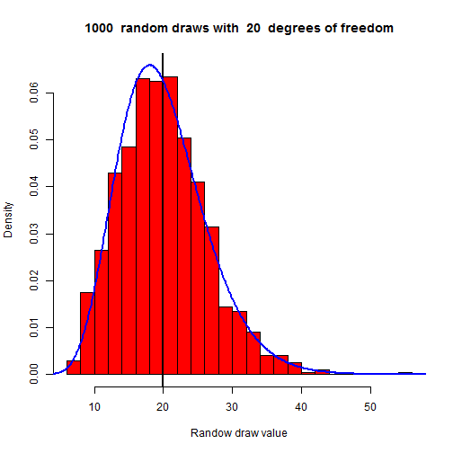
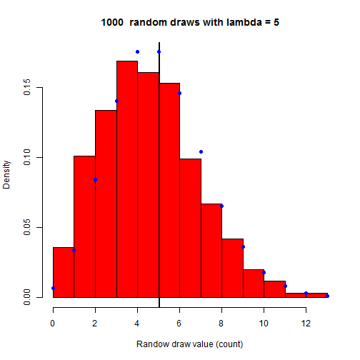

Visualisation of Standard Distributions
========================================================
author: Stefan
date: juli 20 2015
transition: linear

<small> 
Coursera Data Science Specialization
Project assignment
</small>

Purpose of the shiny app
========================================================

The application attempts to visualise common standard probability distributions by comparing the histogram of random draws with the theoretical distribution.

- Normal Distribution
- Poisson Distribution
- Chi Square Distribution
- Student's t Distribution

For each distribution following items are shows :
- histogram of random draws
- mean of the the random draws as vertical line
- theoretical distribution as blue curve 

Example for Chi Square Distribution
========================================================
The PDF (probability density function) for the chi square distribution is parametrised by the degrees of freedom. The larger the sample size of random draws, the closer the result will match the theoretical distribution. 

 

Example for Poisson Distribution
========================================================
The Poisson distribution is the only discrete probability distribution in this app and therefore points are used to show the theoretical distribution.

 

Extendibility
========================================================
The server.R and ui.R source code are written in such a way that the app can be extended very easily with more distritubions.

Visit https://github.com/stefMT2970/DevDataProducts  
download and simply modify the code.
